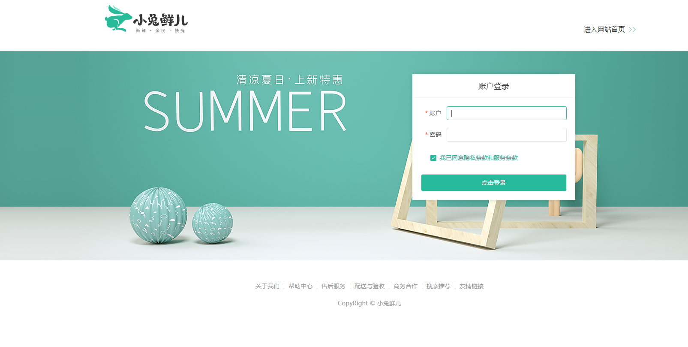
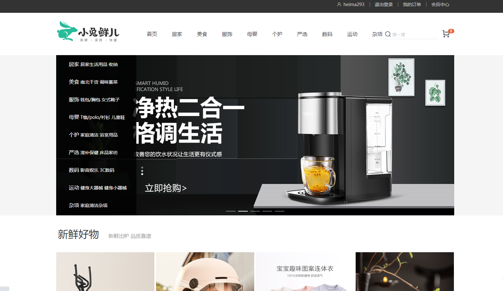
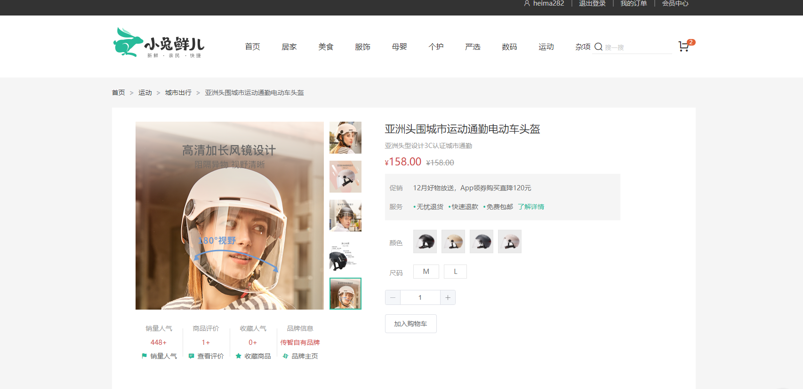
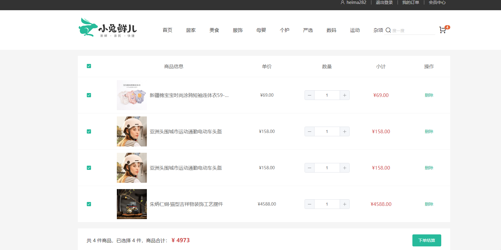
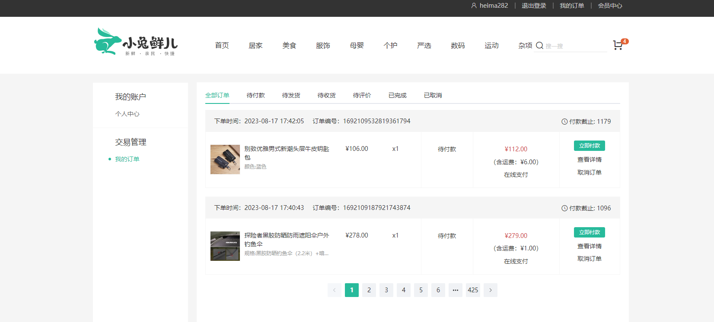

# vue3-rabbit

# 仿小兔鲜儿商城

## 技术选型

vue3 + vite + Pinia

### vue3组合式api体验

1. 代码量变少了
2. 分散式维护转变为集中式维护

## vue3的更多优势

### 更容易维护

1. 组合式API
2. 更好的TS支持

### 更快的速度

1. 重写diff算法
2. 模板编译优化
3. 更高效的组件初始化

### 更小的体积

1. 良好的TreeShanking(摇树优化)

   - 编译阶段利用`ES6 Module`判断哪些模块已经加载

   - 判断那些模块和变量未被使用或者引用，进而删除对应代码

2. 按需引入

### 更优的数据响应式

1. Proxy

## Pinia

Pinia 是vue的专属的最新状态管理库,是Vuex状态管理工具的替代品

1. 提供更加简单的AP!(去掉了mutation)
2. 提供符合组合式风格的API(和Vue3新语法统一)
3. 去掉了modules的概念，每一个store都是一个独立的模块
4. 搭配TypeScript一起使用提供可靠的类型推断

## 项目展示

### 登录

### 首页

### 商品详情

### 购物车

### 会员中心

# 部分功能未完善...
