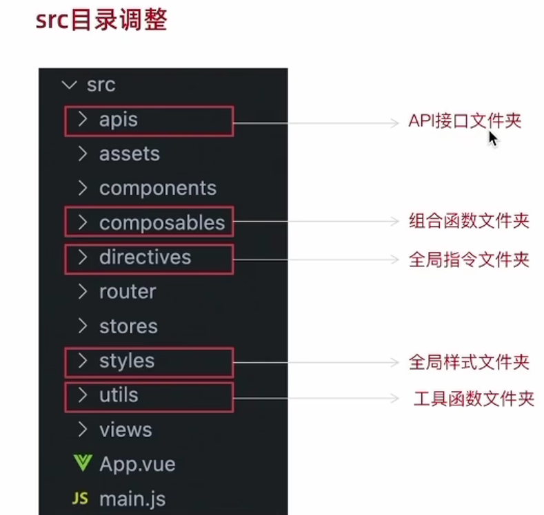

# 小兔鲜儿项目笔记

## 技术选型

vue3 + vite + Pinia

### vue3组合式api体验

1. 代码量变少了
2. 分散式维护转变为集中式维护

### vue3的更多优势

#### 更容易维护

1. 组合式API
2. 更好的TS支持

#### 更快的速度

1. 重写diff算法
2. 模板编译优化
3. 更高效的组件初始化

#### 更小的体积

1. 良好的TreeShanking(摇树优化)

   - 编译阶段利用`ES6 Module`判断哪些模块已经加载

   - 判断那些模块和变量未被使用或者引用，进而删除对应代码

2. 按需引入

#### 更优的数据响应式

1. Proxy

### Pinia

Pinia 是vue的专属的最新状态管理库,是Vuex状态管理工具的替代品

1. 提供更加简单的AP!(去掉了mutation)
2. 提供符合组合式风格的AP!(和Vue3新语法统一)】
3. 去掉了modules的概念，每一个store都是一个独立的模块
4. 搭配TypeScript一起使用提供可靠的类型推断

#### 注意事项:

> 1. 响应式丢失视图不再更新
>
> ```js
> const {count,doubleCount} = counterStore
> ```
>
> 2. 使用 storeToRefs 保持数据响应式
>
> ```js
> const count,doubleCount }=storeToRefs(counterStore)
> ```
>
> 3. **方法**直接从原来的counterStore中解构赋值
>
> ```js
> const {increment }counterStore
> ```

## 

## 项目起步

#### 1.目录调整



#### 2.jsconfig.json配置别名路径

> 配置别名路径可以在写代码时联想提示路径

```json
// 只是起到联想提示路径的作用
{
  "compilerOptions" : {
    "baseUrl" : "./",
    "paths" : {
      "@/*":["src/*"]
    }
  }
}
```

>  实际的路径转换配置  @-> src

```js
import { fileURLToPath, URL } from 'node:url'

import { defineConfig } from 'vite'
import vue from '@vitejs/plugin-vue'

// https://vitejs.dev/config/
export default defineConfig({
  plugins: [
    vue(),
  ],
  resolve: {
    // 实际的路径转换配置 @ -> src
    alias: {
      '@': fileURLToPath(new URL('./src', import.meta.url))
    }
  }
})
```

#### 3.element-puls 引入

1.安装elementPlus和自动导入插件

```bash
npm install element-plus --save
npm install -D unplugin-vue-components unplugin-auto-import
```

2.配置自动按需导入

```js

// 引入插件
import AutoImport from 'unplugin-auto-import/vite'
import Components from 'unplugin-vue-components/vite'
import { ElementPlusResolver } from 'unplugin-vue-components/resolvers'

export default defineConfig({
   // 配置插件
  plugins: [
    AutoImport({
      resolvers: [ElementPlusResolver()],
    }),
    Components({
      resolvers: [ElementPlusResolver()],
    }),
  ],
})
```

3.测试

```html
<el-button type="primary">i am button</el-button>
```

#### 4.定制elementPlus主题

1. 安装 scss

> 基于vite的项目默认不支持css预处理器，需要开发者单独安装

```bash
npm i sass -D
```

2. 准备定制化的样式文件

```scss
/* 只需要重写你需要的即可 */
@forward 'element-plus/theme-chalk/src/common/var.scss' with (
  $colors: (
    'primary': (
      // 主色
      'base': #27ba9b,
    ),
    'success': (
      // 成功色
      'base': #1dc779,
    ),
    'warning': (
      // 警告色
      'base': #ffb302,
    ),
    'danger': (
      // 危险色
      'base': #e26237,
    ),
    'error': (
      // 错误色
      'base': #cf4444,
    ),
  )
)
```

3. 自动导入配置

```js
import { fileURLToPath, URL } from 'node:url'

import { defineConfig } from 'vite'
import vue from '@vitejs/plugin-vue'
import AutoImport from 'unplugin-auto-import/vite'
import Components from 'unplugin-vue-components/vite'
import { ElementPlusResolver } from 'unplugin-vue-components/resolvers'

export default defineConfig({
  plugins: [
    vue(),
    AutoImport({
      resolvers: [ElementPlusResolver()],
    }),
    Components({
      // 配置elementPlus采用sass样式配色系统
      resolvers: [ElementPlusResolver({importStyle: "sass"})],
    }),
  
  ],
   css: {
    preprocessorOptions: {
      scss: {
        // 2.自动导入定制化样式文件进行样式覆盖
        additionalData: `@use "@/styles/element/index.scss" as *;`,
      },
    },
  },
  resolve: {
    // 实际的路径转换配置
    alias: {
      '@': fileURLToPath(new URL('./src', import.meta.url))
    }
  }
})

```

#### 5.axios安装并简单封装

1. 安装axios

```bash
npm i axios
```

2. axios基础配置

> 官方文档地址：[https://axios-http.com/zh/docs/intro](https://axios-http.com/zh/docs/intro)
> 基础配置通常包括：
>
> 1. 实例化 - baseURL + timeout
> 2. 拦截器 - 携带token 401拦截等

```js
import axios from "axios";
//创建一个axios实例
const httpInstance = axios.create({
  baseURL: 'http://pcapi-xiaotuxian-front-devtest.itheima.net',
  timeout: 5000,
  // headers: {'X-Custom-Header': 'foobar'}
});

// 添加请求拦截器
httpInstance.interceptors.request.use(function (config) {
  // 在发送请求之前做些什么
  return config;
}, function (error) {
  // 对请求错误做些什么
  return Promise.reject(error);
});

// 添加响应拦截器
httpInstance.interceptors.response.use(function (response) {
  // 2xx 范围内的状态码都会触发该函数。
  // 对响应数据做点什么
  return response.data;
}, function (error) {
  // 超出 2xx 范围的状态码都会触发该函数。
  // 对响应错误做点什么
  return Promise.reject(error);
});

export default httpInstance


```

3. 接口测试

```js
import  httpInstance  from '@/utils/http'

export function getCategory () {
  return httpInstance({
    url: 'home/category/head'
  })
}
```

#### 6.scss变量自动导入

```css
$xtxColor: #27ba9b;
$helpColor: #e26237;
$sucColor: #1dc779;
$warnColor: #ffb302;
$priceColor: #cf4444;
```

```json
css: {
    preprocessorOptions: {
      scss: {
        // 自动导入scss文件
        additionalData: `
          @use "@/styles/element/index.scss" as *;
          @use "@/styles/var.scss" as *;
        `,
      }
    }
}
```

## 业务实现

### 图片懒加载

两个优化

#### 自定义懒加载组件

1. 抽离组件

```js
import { useIntersectionObserver } from '@vueuse/core'

// 定义懒加载插件
export const lazyPlugin = {
  // 固定方法 install 
  // 用来加载自定义指令
  install(app){
    // 懒加载逻辑
    app.directive('img-lazy', {
      mounted(el, binding ) {
        // el:指令绑定的那个元素 img
        // binding: binding.value 指令等于号后面的表达式的值
        console.log(el,binding);
        const { stop } = useIntersectionObserver(
          el,
          //  通过isIntersecting判断该视图区域 是否在屏幕内 返回boolean
          ([{ isIntersecting }]) => {
            // 进入视口区域
            if(isIntersecting){
              el.src = binding.value
              // useIntersectionObserver是一直存在的 
              // 手动优化停止监听
              stop()
            }
          },
        )
      },
    })
  }
}
export default lazyPlugin


```

2.在main.js文件中引入

```js
import {lazyPlugin} from './dirctives'
app.use(lazyPlugin)
```

#### 组件优化

- useIntersectionObserver是一直存在的 需要手动停止

- 在第一次监听图片加载之后就停止监听
- useIntersectionObserver中返回一个 stop()函数可以停止监听

```js
const { stop } = useIntersectionObserver(
          el,
          //  通过isIntersecting判断该视图区域 是否在屏幕内 返回boolean
          ([{ isIntersecting }]) => {
            // 进入视口区域
            if(isIntersecting){
              el.src = binding.value
              // useIntersectionObserver是一直存在的 
              // 手动优化停止监听
              stop()
            }
          },
        )
```

### GoodsItem组件抽离

因为该模块在项目中需要多次使用,所以抽离成item组件

GoodsItem属于纯展示类组件,这类组件的封装思想是 **抽象Props参数，传入什么就显示什么**

```vue
<!-- @format -->
<script setup>
defineProps({
  good: {
    type: Object,
    default: () => {},
  },
});
</script>
<template>
  <li>
    <RouterLink to="/" class="goods-item">
      
      <p class="name ellipsis">{{ good.name }}</p>
      <p class="desc ellipsis">{{ good.desc }}</p>
      <p class="price">&yen;{{ good.price }}</p>
    </RouterLink>
  </li>
</template>

<style lang="scss" scoped>
li {
  width: 240px;
  height: 300px;
  margin-right: 10px;
  margin-bottom: 10px;

  &:nth-last-child(-n + 4) {
    margin-bottom: 0;
  }

  &:nth-child(4n) {
    margin-right: 0;
  }
}
.goods-item {
  display: block;
  width: 220px;
  padding: 20px 30px;
  text-align: center;
  transition: all 0.5s;

  &:hover {
    transform: translate3d(0, -3px, 0);
    box-shadow: 0 3px 8px rgb(0 0 0 / 20%);
  }

  img {
    width: 160px;
    height: 160px;
  }

  p {
    padding-top: 10px;
  }

  .name {
    font-size: 16px;
  }

  .desc {
    color: #999;
    height: 29px;
  }

  .price {
    color: $priceColor;
    font-size: 20px;
  }
}
</style>

```

### 路由缓存问题

- **响应路由的参数变化**

> 使用带有参数的路由时需要注意的是，当用户从/users./johnny 导航到 /users/jolyne时，**相同的组件实例将被重复使用**。
>
> 因为两个路由都渲染同个组件，比起销毁再创建，复用则显得更加高效。**不过，这也意味着组件的生命周期钩子不会被调用**。

- **问题** 

   一级分类的切换正好满足上面的条件, 组件实例复用, **导致分类数据无法更新** 

- **解决思路**
  1. 让组件实例不复用,强制销毁重建
  2. 监听路由变化，变化之后执行数据更新操作

- **方案一** : 给router-view添加key

  + 以当前路由完整路径为key的值，给router--view组件绑定

    ```vue
    <RouterView key="$route.fullPath"/>
    ```

  + 最常见的是与 `v-for` 的结合:

    ```vue
    <Ul>
    <li v-fors"item in items"key="item.id">...</li>
    </ul>
    ```

  + 也可以用于强制替换一个元素/组件而不是复用它，当你想这么做时他可能会很有用

    - 在适当的时候触发组件的生命周期钩子
    - 触发过渡

  + 缺点：强制销毁重建,所有数据重新获取

- **方案二**：使用 `peforeRouteUpdate` 导航钩子

  + `beforeRouteUpdate` 钩子函数可以在每次路由更新之前执行，在**回调中执行需要数据更新的业务逻辑**即可

  + 或者，使用 `beforeRouteUpdate` 导航守卫，它也可以取消导航：

    ```js
    const User ={
    	template:'...',
    	async beforeRouteUpdate(to,from){
    	//对路由变化做出响应...
    	this.userData await fetchUser(to.params.id)
    	}
    }
    
    ```

> 1. 路由缓存问题产生的原因是什么？
>
>    路由只有参数变化时，会复用组件实例
>
> 2. 俩种方案都可以解决路由缓存问题，如何选择呢？
>    在意性能问题，选择onBeforeUpdate,精细化控制
>    不在意性能问题，选择ky,简单粗暴


### 使用逻辑函数拆分业务

**概念理解：**基于逻辑函数拆分业务是指把**同一个组件中独立的业务代码通过函数做封装处理**，提升**代码的可维护性**

#### 具体实现

1. 按照业务声明以`use`**打头**的逻辑函数
2. 把**独立的业务逻辑**封装到各个函数内部
3. 函数内部把组件中需要用到的数据或者方法**return出去**
4. 在**组件中调用函数**把数据或者方法组合回来使用

#### 核心思想总结

1. 逻辑拆分的过程是一个拆分再组合的过程

   

2. 函数use打头，内部封装逻辑，return组件需要用到的数据和方法给组件消费

   

### 列表无限加载功能

核心实现逻辑：使用elementPlus提供的v-infinite-scroll指令**监听是否满足触底条件**，满足加载条件时让**页数参数加一获取下一页数据，做新老数据拼接渲染**


```vue
<script setup>
  const disabled = ref(false);
  const load = async () => {
  reqData.value.page++;
  const res = await getSubCategoryAPI(reqData.value);
  goodsList.value = [...goodsList.value, ...res.result.items];
  if (res.result.items.length === 0) {
    disabled.value = true;
  }
};
</script>


<div class="body" v-infinite-scroll="load" :infinite-scroll-disabled="disabled">
        <!-- 商品列表-->
        <GoodsItem v-for="item in goodsList" :key="item.id" :good="item"></GoodsItem>
 </div>
```

### 路由行为定制

在不同路由切换的时候，可以**自动滚动到页面的顶部**，而不是停留在原先的位置

```js
const router = createRouter({
  history: createWebHistory(import.meta.env.BASE_URL),
  routes: [...],
  // 路由滚动行为定制
  scrollBehavior() {
    return { top: 0 };
  },
});
```

### 空对象报错


错误原因：goods一开始{}  {}.categories -> undefined -> undefined[1]

解决方法:

1. 可选链的语法?.  `goods.categories?.[1].name`

```vue
<div class="bread-container">
        <el-breadcrumb separator=">">
          <el-breadcrumb-item :to="{ path: '/' }">首页</el-breadcrumb-item>
          <el-breadcrumb-item :to="{ path: `/category/${goods.categories?.[1].name}` }">
            {{ goods.categories?.[1].name }}
          </el-breadcrumb-item>
          <el-breadcrumb-item :to="{ path: `/category/sub/${goods.categories?.[0].name}` }">
            {{ goods.categories?.[0].name }}
          </el-breadcrumb-item>
          <el-breadcrumb-item>{{ goods.name }}</el-breadcrumb-item>
        </el-breadcrumb>
      </div>
```

2.  v-if手动控制渲染时机,保证有数据才渲染

```vue
  <div class="container" v-if="goods.details">
      <div class="bread-container">
        <el-breadcrumb separator=">">
          <el-breadcrumb-item :to="{ path: '/' }">首页</el-breadcrumb-item>
          <el-breadcrumb-item :to="{ path: `/category/${goods.categories[1].name}` }">
            {{ goods.categories[1].name }}
          </el-breadcrumb-item>
          <el-breadcrumb-item :to="{ path: `/category/sub/${goods.categories[0].name}` }">
            {{ goods.categories[0].name }}
          </el-breadcrumb-item>
          <el-breadcrumb-item>{{ goods.name }}</el-breadcrumb-item>
        </el-breadcrumb>
      </div
  </div>
```

### 全局组件注册

```js
// components 下 index.js
// 把components中的所组件都进行全局化注册
// 通过插件的方式
import ImageView from './ImageView/index.vue';
// import Sku from './XtxSku/index.vue';
export const componentPlugin = {
  install(app) {
    // app.component('组件名字'，组件配置对象)
    app.component('XtxImageView', ImageView);
    // app.component('XtxSku', Sku);
  },
};
```

```js
//main.js
import { componentPlugin } from './components/idnex.js';
const app = createApp(App);
app.use(componentPlugin);
app.mount('#app');
```


### 图片预览组件


#### 通过小图切换大图实现

思路：维护一个数组图片列表，**鼠标划入小图记录当前小图下标值，通过下标值在数组中取对应图片**，显示到大图位置


#### 放大镜效果实现

**功能拆解:**

1. 左侧滑块跟随鼠标移动
2. 右侧大图放大效果实现
3. 鼠标移入控制滑块和大图显示隐减


**放大镜效果实现-滑块跟随鼠标移动**

思路：获取到当前的**鼠标在盒子内的相对位置(useMouselnElement)**,控制滑块跟随鼠标移动(left/top)

获取鼠标相对位置 => 控制滑块跟随移动

1. 有效移动范围内的计算逻辑

   横向：100<elementX<300,left=elementX-小滑块宽度一半

   纵向：100<elementY<300,top=elementY-小滑块高度一半

2. 边界距离控制

   横向：elementX>300 left=200 elementX <100 left =0

   纵向：elementY>300 top=200 elementY<100 top=0

**放大镜效果实现~大图效果实现**

效果：为实现放大效果，大图的宽高是小图的俩倍

思路：大图的移动方向和滑块移动方向相反，且数值为2倍

思路：鼠标移入盒子(isOutside),滑块和大图才显示(v-show)


### 通用组件统一注册全局

#### 为什么要优化

背景：components目录下有可能还会有很多其他通用型组件，有可能在多个业务模块中共享，所有统一进行全局组件注册比较好


### Pinia持久化

安装插件 `**pinia-persistedstate-plugin**`

1. 安装依赖：

```
npm i pinia-persistedstate-plugin
```

2. 引入该插件，在创建 *pinia* 实例时传入该插件

*src/store/index.js*：

```js
import { createPinia } from 'pinia';
import { createPersistedState } from 'pinia-persistedstate-plugin';
const pinia = createPinia();
pinia.use(createPersistedState());
export default pinia;
```

main.js:

```js
import { createApp } from 'vue'
import store from './store/index'
 
const app = createApp(App)
app.use(store)
app.mount('#app')
```

*src/store/user.js*：

```js

import { ref } from 'vue';
import { defineStore } from 'pinia';
import { loginAPI } from '@/apis/login.js';

export const useUserStore = defineStore(
  'login',
  () => {
    // 1. 定义管理用户数据的state
    const userInfo = ref({});
    // 2. 定义获取接口数据的action函数
    const getUserInfo = async ({ account, password }) => {
      const res = await loginAPI({ account, password });
      userInfo.value = res.result;
    };
    // 3. 以对象的格式把state和action return
    return { userInfo, getUserInfo };
  },
  {
    persist: true, //可以自定义配置存储的地方，这是默认储存
  }
);
```

### axios token携带

```js
//1.从pinia获取token数据
    const userStore = useUserStore();
    const token = userStore.userInfo.token;
    if (token) {
      //2按照后瑞的要求拼接土okn数据
      config.headers['Authorization'] = `Bearer ${token}`;
    }
```

### 购物车功能实现

#### 购物车业务逻辑梳理拆解


1. 整个购物车的实现分为俩个大分支，**本地购物车操作和接口购物车操作**
2. 由于购物车数据的特殊性，**采取Pinia管理购物车列表数据并添加持久化缓存**

#### 本地购物车 - 加入购物车实现


`stores/cartStore.js`

```js
/** @format */

// 封装购物车模块

import { ref } from 'vue';
import { defineStore } from 'pinia';

export const useCartStore = defineStore(
  'cart',
  () => {
    //1. 定义state - cartList
    const cartList = ref([]);
    //2. 定义action - addCart
    const addCart = goods => {
      // 添加购物车操作
      //已添加过-count+1
      //没有添加过-直接push
      //思路：通过匹配传递过来的商品对象中的skuId能不能在cartList中找到，找到了就是添加过
      const item = cartList.value.find(v => v.skuId == goods.skuId);
      if (item) {
        item.count++;
      } else {
        cartList.value.push(goods);
      }
      console.log(cartList.value);
    };
    return { cartList, addCart };
  },
  {
    persist: true, //可以自定义配置存储的地方，这是默认储存
  }
);
```

`Detail/idnex`

```vue
<script setup>
// sku规格被操作时
let skuObj = {};
const skuChange = sku => {
  skuObj = sku;
  console.log(skuObj);
};

// 商品计数
const count = ref(1);
const countChange = number => {
  console.log(number);
  // count.value = number
};

// 添加购物车
const addCart = () => {
  if (skuObj.skuId) {
    // 规格已经选择 触发 action 函数
    cartStore.addCart({
      id: goods.value.id, // 商品id
      name: goods.value.name, // 商品名称
      picture: goods.value.mainPictures[0], // 图片
      price: goods.value.price, // 商品价格
      count: count.value, // 商品数量
      skuId: skuObj.skuId, // skuId
      attrsText: skuObj.specsText, // 商品规格文本
      selected: true, // 商品是否选中
    });
  } else {
    // 规格没有选择 提示用户
    ElMessage({ type: 'warning', message: '请选择规格' });
  }
};
</script>


<template>
  <!-- sku组件 -->
<XtxSku :goods="goods" @change="skuChange"></XtxSku>
  <!-- 数据组件 -->
<el-input-number v-model="count" :min="1" @change="countChange" />
   <!-- 按钮组件 -->
<div>
  <el-button size="large" class="btn" @click="addCart">加入购物车</el-button>
</div>
</template>
```

#### 本地购物车-删除功能

```js
// 删除购物车
    const delCart = skuId => {
      // 思路:
      // 1.找出要删除的下角标 - splice
      // 2.过滤方法筛 - filter
      cartList.value = cartList.value.filter(v => v.skuId != skuId);

      // const index = cartList.value.findIndex(v => v.skuId == skuId);
      // cartList.value.splice(index,1)
    };
```


#### 本地购物车-头部计算


```js
//计算属性
    //1.总的数量所有项的count之和reduce((每一次累加之后的和,每一项)=>a+c,设置初始值为零)
    const allCount = computed(() => cartList.value.reduce((a, c) => a + c.count, 0));
    //2.总价所有项的count*price之和
    const allPrice = computed(() => cartList.value.reduce((a, c) => a + c.count * c.price, 0));
```

#### 本地购物车-单选功能

核心思路：单选的核心思路就是始终把**单选框的状态和Pinia中store对应的状态保持同步**
注意事项：v-model双向绑定指令不方便进行命令式的操作（因为后续还需要调用接口)，
所以把v-model回退到一般模式，也就是：**model-value和@change的配合实现**


```vue
 <el-checkbox
                  :model-value="i.selected"
                  @change="selected => singleCheck(i, selected)" />
```

根据skuId来设置选中状态

```js
const singleCheck = (i, selected) => {
  // console.log(i, selected);
  //store cartList数组无法知道要修改谁的选中状态？
  //除了selected补充一个用来筛选的参数-skuId
  cartStore.singleCheck(i.skuId, selected);
};
```

```js
// pinia
const singleCheck = (skuId, selected) => {
      const item = cartList.value.find(v => v.skuId == skuId);
      item.selected = selected;
    };
```

#### 列表购物车-全选

核心思路：

1. 操作单选决定全选：只有当cartList中的所有项都为true时，全选状态才为true
2. 操作全选决定单选：cartList中的所有项的selected都要跟着一起变


`view/cartList`

```vue
<template>
 <el-checkbox
                  :model-value="i.selected"
                  @change="selected => singleCheck(i, selected)" />
</template>
<script setup>
import { useCartStore } from '@/stores/cartStore';
const cartStore = useCartStore();

//全选
const allCheck = selected => {
  console.log(selected);
  cartStore.allCheck(selected);
};
</script>
```

`stores/cartList`

```js
//全选功能
    const allCheck = selected => {
      cartList.value.forEach(v => (v.selected = selected));
    };
// 是否全选  所有单选都为true 全选选中
    const isAll = computed(() => cartList.value.every(v => v.selected == true));
```

#### 列表购物车-统计数据

```js
// 3. 选中数量
    const selectedCount = computed(() =>
      cartList.value.filter(v => v.selected).reduce((a, c) => a + c.count, 0)
    );

    // 4. 已选择商品价钱合计
    const selectedPrice = computed(() =>
      cartList.value.filter(v => v.selected).reduce((a, c) => a + c.count * c.price, 0)
    );
```

#### 接口购物车-加入购物车


```js
import { computed, ref } from 'vue';
import { defineStore } from 'pinia';
import { useUserStore } from './userStore';
import { insertCartAPI, findNewCartListAPI, delCartAPI } from '@/apis/cart';
 
export const useCartStore = defineStore(
  'cart',
  () => {
 // 添加购物车
    const addCart = async goods => {
      const { skuId, count } = goods;
      if (isLogin.value) {
        // 登录之后的加入购车逻辑
        await insertCartAPI({ skuId, count });
        updateNewList();
      } else {
        // 添加购物车操作
        //已添加过-count+1
        //没有添加过-直接push
        //思路：通过匹配传递过来的商品对象中的skuId能不能在cartList中找到，找到了就是添加过
        const item = cartList.value.find(v => v.skuId == goods.skuId);
        if (item) {
          item.count++;
        } else {
          cartList.value.push(goods);
        }
      }
    };
  }
```


#### 接口购物车-删除购物车


```js
import { computed, ref } from 'vue';
import { defineStore } from 'pinia';
import { useUserStore } from './userStore';
import { insertCartAPI, findNewCartListAPI, delCartAPI } from '@/apis/cart';

export const useCartStore = defineStore(
  'cart',
  () => {
  // 删除购物车
    const delCart = async skuId => {
      if (isLogin.value) {
        // 调用接口实现接口购物车中的删除功能
        console.log(skuId);
        await delCartAPI([skuId]);
        updateNewList();
      } else {
        // 思路:
        // 1.找出要删除的下角标 - splice
        // 2.过滤方法筛 - filter
        cartList.value = cartList.value.filter(v => v.skuId != skuId);
      }
    };
  
  }

```

#### 退出登录-清空购物车列表

`Layout/components/LayoutNav.vue`

```js
<script setup>
import { useUserStore } from '@/stores/userStore';
import { useCartStore } from '@/stores/cartStore';

import { useRouter } from 'vue-router';
const userStore = useUserStore();
const cartStore = useCartStore();
const router = useRouter();
const confirm = () => {
  // 退出登录业务逻辑实现
  userStore.clearUserInfo();
  cartStore.clearCart();
  router.push('/login');
};
</script>
```

#### 合并购物车业务实现

问：用户在非登录时进行的所有购物车操作，我们的服务器能知道吗？
答：不能！不能的话不是白操作了吗？还本地购物车的意义在哪？
解决办法：在**用户登录**时，把**本地的购物车数据**和**服务端购物车数据**进行合并操作


在登陆的时候进行合并 `sotres/userStore`

合并之后再更新数据

```js
/** @format */

import { ref } from 'vue';
import { defineStore } from 'pinia';
import { loginAPI } from '@/apis/login.js';
import { mergeCartAPI } from '@/apis/cart.js';
import { useCartStore } from './cartStore';
export const useUserStore = defineStore(
  'login',
  () => {
    const cartStore = useCartStore();
    // 1. 定义管理用户数据的state
    const userInfo = ref({});
    // 2. 定义获取接口数据的action函数
    // 登录
    const getUserInfo = async ({ account, password }) => {
      const res = await loginAPI({ account, password });
      userInfo.value = res.result;
      // 合并购物车操作
      await mergeCartAPI(
        cartStore.cartList.map(item => {
          return {
            skuId: item.skuId,
            selected: item.selected,
            count: item.count,
          };
        })
      );
      cartStore.updateNewList();
    };

    // 3. 以对象的格式把state和action return
    return { userInfo, getUserInfo, clearUserInfo };
  },
  {
    persist: true, //可以自定义配置存储的地方，这是默认储存
  }
);

```

### 支付业务流程


使用支付地址 `payUrl`

设置支付地址 回跳地址

在使用支付宝的链接格式将地址填入

```js
// 跳转支付
// 携带订单id以及回调地址跳转到支付地址（get）
// 支付地址
const baseURL = 'http://pcapi-xiaotuxian-front-devtest.itheima.net/';
const backURL = 'http://127.0.0.1:5173/paycallback';
const redirectUrl = encodeURIComponent(backURL);
const payUrl = `${baseURL}pay/aliPay?orderId=${route.query.id}&redirect=${redirectUrl}`;
```

### 封装倒计时逻辑函数


```js
/** @format */

// 封装倒计时逻辑函数

import { computed, onUnmounted, ref } from 'vue';
import dayjs from 'dayjs';
export const useCountDown = () => {
  // 1. 响应式数据
  let timer = null;
  const time = ref(0);
  // 格式化时间
  const formatTime = computed(() => dayjs.unix(time).format('mm分ss秒'));
  // 2. 开启倒计时函数
  const start = currentTime => {
    time.value = currentTime;
    timer = setInterval(() => {
      time.value--;
    }, 1000);
  };
  // 组件销毁时清除定时器
  onUnmounted(() => {
    timer && clearInterval(timer);
  });
  return {
    formatTime,
    start,
  };
};

```

### 封装函数思想

1. 编写函数框架,**确定参数和返回值**
2. 编写核心逻辑实现逻辑功能
3. 实现最终效果

## 重点:SKU组件

**SKU的概念**：存货单位（英语：stock keeping unit),也翻译为库存单元，是一个会计学名词，定义为**库存管理中的最小可用单元**，

例如纺织品中一个SKU通常表示规格、颜色、款式，而在连锁零售门店中有时称单品为一个SKU


**SKU组件的作用**：产出当前用户选择的商品规格，为加入购物车操作提供数据信息

**SKU组件使用：**
问：在实际工作中，经常会遇到别人写好的组件，熟悉一个三方组件，首先重点看什么？
答：props和emit,**props决定了当前组件接收什么数据，emit决定了会产出什么数据**

**验证组件是否成功使用:**

传入必要数据是否交互功能正常 => 点击选择规格，是否正常产出数据

### 认识SKU组件

SKU组件的作用是为了让用户能够选择商品的规格，从而提交购物车，在选择的过程中，组件的**选中状态要进行更新**，
组件还要**提示用户当前规格是否禁用**，每次选择都要**产出对应的Sku数据**


### 实现步骤:


### Sku组件封装

#### 1. 准备模版渲染规格数据

> 使用Vite快速创建一个Vue项目，在项目中添加请求插件axios，然后新增一个SKU组件，在根组件中把它渲染出来，下面是规格内容的基础模板

```vue
<script setup>
import { onMounted, ref } from 'vue'
import axios from 'axios'
// 商品数据
const goods = ref({})
const getGoods = async () => {
  // 1135076  初始化就有无库存的规格
  // 1369155859933827074 更新之后有无库存项（蓝色-20cm-中国）
  const res = await axios.get('http://pcapi-xiaotuxian-front-devtest.itheima.net/goods?id=1369155859933827074')
  goods.value = res.data.result
}
onMounted(() => getGoods())

</script>

<template>
  <div class="goods-sku">
    <dl v-for="item in goods.specs" :key="item.id">
      <dt>{{ item.name }}</dt>
      <dd>
        <template v-for="val in item.values" :key="val.name">
          <!-- 图片类型规格 -->
          
          <!-- 文字类型规格 -->
          <span v-else>{{ val.name }}</span>
        </template>
      </dd>
    </dl>
  </div>
</template>

<style scoped lang="scss">
@mixin sku-state-mixin {
  border: 1px solid #e4e4e4;
  margin-right: 10px;
  cursor: pointer;

  &.selected {
    border-color: #27ba9b;
  }

  &.disabled {
    opacity: 0.6;
    border-style: dashed;
    cursor: not-allowed;
  }
}

.goods-sku {
  padding-left: 10px;
  padding-top: 20px;

  dl {
    display: flex;
    padding-bottom: 20px;
    align-items: center;

    dt {
      width: 50px;
      color: #999;
    }

    dd {
      flex: 1;
      color: #666;

      >img {
        width: 50px;
        height: 50px;
        margin-bottom: 4px;
        @include sku-state-mixin;
      }

      >span {
        display: inline-block;
        height: 30px;
        line-height: 28px;
        padding: 0 20px;
        margin-bottom: 4px;
        @include sku-state-mixin;
      }
    }
  }
}
</style>
```

#### 2. 选中和取消选中实现

>基本思路：
>
>1. 每一个规格按钮都拥有自己的选中状态数据-selected，true为选中，false为取消选中
>2. 配合动态class，把选中状态selected作为判断条件，true让active类名显示，false让active类名不显示
>3. 点击的是未选中，把同一个规格的其他取消选中，当前点击项选中；点击的是已选中，直接取消

核心思路：

1. 如果当前已经激活了，就取消激活
2. 如果当前未激活，**就把和自己同排的其他规格取消激活**，再把自己激活

响应式数据设计：

每一个规格项都添加一个selected.字段来决定是否激店，true为激活，false为未激活

样式处理：
使用selectedi配合动态class属性，selected为true就显示对应激活类名

```vue
<script setup>
// 省略代码

// 选中和取消选中实现
const changeSku = (item, val) => {
  // 点击的是未选中，把同一个规格的其他取消选中，当前点击项选中，点击的是已选中，直接取消
  if (val.selected) {
    val.selected = false
  } else {
    item.values.forEach(valItem => valItem.selected = false)
    val.selected = true
  }
}

</script>

<template>
  <div class="goods-sku">
    <dl v-for="item in goods.specs" :key="item.id">
      <dt>{{ item.name }}</dt>
      <dd>
        <template v-for="val in item.values" :key="val.name">
          
          <span v-else 
            @click="changeSku(val)" 
            :class="{ selected: val.selected }">{{ val.name }}</span>
        </template>
      </dd>
    </dl>
  </div>
</template>
```

#### 3. 点击规格更新禁用状态

##### 生成有效路径字典(1)

规格禁用的判断依据是什么？


> 根据skus中相同的规格名称和库存来判断
>
> **核心原理：**当前的规格Sku,或者组合起来的规格SkU,在skuS数组中对应项的库存为零时，当前规格会被禁用，生成
> 路径字典是为了**协助和简化这个匹配过程**

##### 生成有效路径字典(2)


**实现步骤：**

1. 根据库存字段得到有效的Sku数组
2. 根据有效的Sku数组使用powerSets算法得到所有子集
3. 根据子集生成路径字典对象

`index.vue`

```js
// 生成有效路径字典对象
const getPathMap = goods => {
  const pathMap = {};
  // 1.根据库存字段得到有效的Sku数组
  const effectiveSkus = goods.skus.filter(sku => sku.inventory > 0);

  // 2.根据有效的sku使用算法 (子集算法) [1,2] => [[1],[2],[1,2]]
  effectiveSkus.forEach(sku => {
    // 2.1 获取匹配的valueName:组成的数组
    const selectedValArr = sku.specs.map(val => val.valueName);
    //2.2使用算法获取子集
    const valArrPowerSet = bwPowerSet(selectedValArr);
    //3.把得到子集生成最终的路径字典对象
    valArrPowerSet.forEach(arr => {
      // 初始化key数组join->字符串对象的key
      const key = arr.join('-');
      //如果已经存在当前key了就往数组中直接添加skuId如果不存在key直接做赋值
      if (pathMap[key]) {
        pathMap[key].push(sku.id);
      } else {
        pathMap[key] = [sku.id];
      }
    });
  });
  return pathMap;
};
```

`power-set.js`

```js
// 幂集算法
export default function bwPowerSet(originalSet) {
  const subSets = [];

  // We will have 2^n possible combinations (where n is a length of original set).
  // It is because for every element of original set we will decide whether to include
  // it or not (2 options for each set element).
  const numberOfCombinations = 2 ** originalSet.length;

  // Each number in binary representation in a range from 0 to 2^n does exactly what we need:
  // it shows by its bits (0 or 1) whether to include related element from the set or not.
  // For example, for the set {1, 2, 3} the binary number of 0b010 would mean that we need to
  // include only "2" to the current set.
  for (let combinationIndex = 0; combinationIndex < numberOfCombinations; combinationIndex += 1) {
    const subSet = [];

    for (let setElementIndex = 0; setElementIndex < originalSet.length; setElementIndex += 1) {
      // Decide whether we need to include current element into the subset or not.
      if (combinationIndex & (1 << setElementIndex)) {
        subSet.push(originalSet[setElementIndex]);
      }
    }

    // Add current subset to the list of all subsets.
    subSets.push(subSet);
  }

  return subSets;
}

```

##### 初始化规格禁用

思路：遍历每一个规格对象，使用name字段作为key去路径字典pathMap中做匹配，匹配不上则禁用


怎么做到显示上的禁用呢？

1. 通过增加disabled字段，匹配上路径字段，disabled为false,匹配不上路径字段，disabled为true
2. 配合动态类名控制禁用类名

```js
// 初始化禁用状态
const initDisabledStatus = (specs, pathMap) => {
  specs.forEach(specs => {
    specs.values.forEach(val => {
      if (pathMap[val.name]) {
        val.disabled = false;
      } else {
        val.disabled = true;
      }
    });
  });
};
```

##### 点击时组合禁用更新


思路（点击规格时)：

1. **按照顺序**得到规格选中项的数组**['蓝色'，20cm',undefined]**

2. 遍历每一个规格

   2.1把name字段的值填充到对应的位置
   2.2过滤掉undefined.项使用join方法形成一个有效的key
   2.3使用key去pathMap中进行匹配，匹配不上，则当前项禁用

```js
// 得到当前选中规格集合
const getSelectedArr = specs => {
  const selectedArr = [];
  specs.forEach((spec, index) => {
    const selectedVal = spec.values.find(val => val.selected);
    if (selectedVal) {
      selectedArr[index] = selectedVal.name;
    } else {
      selectedArr[index] = undefined;
    }
  });
  return selectedArr;
};

// 更新按钮的禁用状态
const updateDisabledStatus = (specs, pathMap) => {
  // 遍历每一种规格
  specs.forEach((item, i) => {
    // 拿到当前选择的项目
    const selectedArr = getSelectedArr(specs);
    console.log(selectedArr, 'selectedArr');
    console.log(item, 'item');
    // 遍历每一个按钮
    item.values.forEach(val => {
      if (!val.selected) {
        selectedArr[i] = val.name;
        // 去掉undefined之后组合成key
        const key = selectedArr.filter(value => value).join('-');
        val.disabled = !pathMap[key];
      }
    });
  });
};
```


##### 产出有效的SKU信息


如何判断当前用户已经选择了所有有效的规格？
已选择项数组['蓝色'，20cm',undefined]中找不到undefined,那么用户已经选择了所有的有效规格，此时可以产出数据

如何获取当前的SKU信息对象？
把已选择项数组拼接为路径字典的key,去路径字典pathMap中找即可


## 建议

后期进行项目重构,使用 vue3 + TS 完成项目